### Конфигурация

Файл .env для конкретной специфики рабочего окружения.
Файл config/index.js для конфигурация приложения.
Файл credentials.js для шифрования, должен быть вынесен за пределы папки разработки.  

### Запуск

```
# run db server (for the first launch, run the file ..../dir_certs/init.sh !)
db/cocroach/run-https/dir_certs/run-cluster.sh

# run web server
nmp run run-dev

# run propxy https
./run-ngrok.sh

```

### Запуск сервера после прохождения тестов

package.json:

```
"scripts":{
    "test-unit": "mocha test/unit/*.js 2>/dev/null",
    "scan-eslint": "eslint app.js",
    "hbs-precompilation": "node_modules/handlebars/bin/handlebars -m ui/views/templates/ > ui/public/templates.js",
    "run-dev": "npm run test-unit && npm run hbs-precompilation &&  node app.js",
  },
```

```bash
npm run run-dev
```

### Используемые библиотеки

Typescript
```
npm install --save-dev @types/core-js
```

Routing, view template

```bash
npm i express
npm i -save body-parser
npm i --save formidable
npm i --save cookie-parser
npm i --save express-session
npm i --save nodemailer
```

Cluster
```bash
npm i os --save
npm i cluster
npm i es-main
npm i domain --save
```

Handlebars
```bash
npm i --save express-handlebars
```

Testing library

```bash
npm i --save-dev mocha
npm i --save-dev chai
```

Pretty code

```bash
npm i --save-dev eslint
```

### Алиасы путей

package.json:
```
  "scripts": {
    "postinstall": "link-module-alias"
  },
  "_moduleAliases": {
    "~root": ".",
    "~config": "./config/index.js",
    "~lib": "./lib",
    "~db": "./db",
    "~ui": "./ui",
    "~network": "./network"
  },
```
Использование алиасов
```
import {getUsers,UserDTO} from "../../db/orm/mod-export.js"; // до

import {getUsers,UserDTO} from "~db/mod-export.js"; // после
```


#### Подготовка отображения результатов тестирования в браузере

```bash
mkdir public-test/vendor
cp node_modules/mocha/mocha.js public-test/vendor
cp node_modules/mocha/mocha.css public-test/vendor

```

Отображение тестов в браузере:
 * NODE_ENV=development
 * get url `?test=1`
 * set variable `showTests`,`pageTestScript`
 * `jquery` library for view assertions

Использование `pageTestScript`:
```
    app.get("/about", function(req, res){
        res.render("about", {
            fortune: fortune.getFortune(),
            pageTestScript: "/qa/tests-about.js"
        });
    });
```
Использование `showTests`:
```
    // testing in browser
    app.use(function (req, res, next) {
        // передать в view переменную showTests
        res.locals.showTests = app.get("env") !== "production" && req.query.test === "1";
        next();
    });
    // widget
    app.use(function (req, res, next) {
        if (!res.locals.partials) res.locals.partials = {};
        res.locals.partials.weatherContext = weather.getWeatherData();
        next();
    });
```


### Help

Kill pid process on port 3000

```bash
lsof -n -i4TCP:3000 | grep LISTEN | tr -s ' ' | cut -f 2 -d ' ' | xargs kill -9
# https kill pid
lsof -i:3000 | grep LISTEN|tr -s ' '| cut -f 2 -d ' '  | xargs kill -9

```


### [Handlebars](https://handlebarsjs.com/iation/precompilation.html)  

Для формирования представлений с помощью handlebars используется компиляция на клиенте
```html
<script src="https://cdn.jsdelivr.net/npm/handlebars@latest/dist/handlebars.js"></script>
<script>
  var template = Handlebars.compile("Handlebars <b>{{doesWhat}}</b>");
  console.log(template({ doesWhat: "rocks!" }));
</script>
```

Но лучше использовать прекомпиляцию на сервере!

```
// На backend'e все шаблоны скомпилировать в один файл:

views/templates/nameExample.hbs:

    Handlebars <b>{{doesWhat}}</b> precompiled!


$ node_modules/handlebars/bin/handlebars -m views/templates/ > public/templates.js

Подключение на view подключить минифицированный handlebars.runtime.js:

<script src="https://cdn.jsdelivr.net/npm/handlebars@latest/dist/handlebars.runtime.js"></script>
<script src="templates.js"></script>
<script>
         $(document).ready(function(){
             var template = Handlebars.templates.nameExample;
             let html = template({doesWhat: 'rocks!'});
         });
</script>
```


Чтобы передать код в layouts из текущего шаблона, я использую helpers

```
// Application backend:

import exphbs from "express-handlebars";
import express from "express";
let app = express();

app.engine("handlebars", exphbs({
    helpers: {
        section:function(name,options){
            if(!this._sections) this._sections = {};
            this._sections[name] = options.fn(this);
            return null;
        }
    }
}));


// View js client layouts.hbs:
===============================
</head>
    {{{_sections.head}}}
</head>
<body>
 {{{body}}}
 {{{_sections.jquery}}}
</body>
===============================
// View js client body.hbs template:

{{#section 'head'}}
    <meta name="robots" content="noindex">
{{/section}}

{{#section 'jquery'}}
    <script>
        $('document').ready(function(){
            $('h1').html('jQuery работает');
        });
    </script>
{{/section}}
===============================
```

### Горизонтальное масштабирование с помощью кластеров приложений

Кластеры для роли отказоустойчивой ситемы и обработки неперехваченных исключений.
Файл `app_cluster.js` для запуска кластера
Файл `app.js` для запуска одного сервера

Для непосредственно запущенного файла  `cluster.isMaster = true`, в котором мы
создаем по количеству CPU fork'и подписываемся на события `disconnect`, `exit`.
Далее каждый fork выполняя этот файл `cluster.isMaster = false, cluster.isWorker = true`
запустит сервер из модуля `app.js`

Для обработки неперехваченных исключений используется механизм предоставляемый domain
который оборачивает все запросы и в случае неперехваченного исключеня "мягко" останавливает сервер
через некоторое время.


###  CockroachDB

[Install CockroachDB:](https://www.cockroachlabs.com/docs/stable/build-a-nodejs-app-with-cockroachdb.html)

1.Установите CockroachDB:

```
wget -qO- https://binaries.cockroachdb.com/cockroach-v20.2.4.linux-amd64.tgz | tar xvz
sudo cp -i cockroach-v20.2.4.linux-amd64/cockroach /usr/local/bin/
```

2.Запустите безопасный локальный кластер.

[Запустить одноузловой кластер:](https://www.cockroachlabs.com/docs/v20.2/cockroach-start-single-node#start-a-single-node-cluster)

Создайте два каталога для сертификатов:
```
cd dir_certs

mkdir certs my-safe-directory
```
Создайте сертификат CA (центр сертификации) и пару ключей:
```
cd dir_certs

cockroach cert create-ca \
--certs-dir=certs \
--ca-key=my-safe-directory/ca.key

```

Создайте пару сертификата и ключа для узла:  
```
cd dir_certs

cockroach cert create-node \
localhost \
$(hostname) \
--certs-dir=certs \
--ca-key=my-safe-directory/ca.key
```

Создайте клиентский сертификат и пару ключей для root пользователя:
```
cd dir_certs

cockroach cert create-client \
root \
--certs-dir=certs \
--ca-key=my-safe-directory/ca.key
```

Запустите одноузловой кластер:
```
cd dir_certs

cockroach start-single-node \
--certs-dir=certs \
--listen-addr=localhost:26257 \
--http-addr=localhost:8080 \
--background
```  

output console:
```
webui:               https://localhost:8080
sql:                 postgresql://root@localhost:26257?sslcert=certs%2Fclient.root.crt&sslkey=certs%2Fclient.root.key&sslmode=verify-full&sslrootcert=certs%2Fca.crt
RPC client flags:    cockroach <client cmd> --host=localhost:26257 --certs-dir=certs
logs:                /home/jeka/projects/node/Node_Express/dir_certs/cockroach-data/logs
temp dir:            /home/jeka/projects/node/Node_Express/dir_certs/cockroach-data/cockroach-temp062332629
external I/O path:   /home/jeka/projects/node/Node_Express/dir_certs/cockroach-data/extern
store[0]:            path=/home/jeka/projects/node/Node_Express/dir_certs/cockroach-data
storage engine:      pebble
status:              initialized new cluster
clusterID:           023bade1-3e57-47e5-a849-c0d7c69c0f4e
nodeID:              1

```

Узлы уже были запущены cockroach start и ожидают инициализации в качестве нового кластера
```
cockroach init --certs-dir=certs --host=localhost:26257
```


Для остановки узла:
```
cd dir_certs

cockroach quit \
--certs-dir=certs \
--host=localhost:26257
```  


Встроенный клиент:  
```
cd dir_certs
cockroach sql --certs-dir=certs --host=localhost:26257

root@localhost:26257/defaultdb> CREATE DATABASE storage;
root@localhost:26257/defaultdb> SET database = storage;
root@localhost:26257/storage> CREATE TABLE test (id INT PRIMARY KEY, balance DECIMAL);
root@localhost:26257/storage> INSERT INTO test VALUES (1, 1000.50);
root@localhost:26257/storage> SELECT * FROM test;
root@localhost:26257/storage> \q
```  

Создание пользователя (к примеру: `max`) для доступа к базе данных:

```
cockroach sql --certs-dir=certs --host=localhost:26257
root@localhost:26257/defaultdb>  CREATE USER max WITH PASSWORD 'roach';
```
Присвоить пользователя `max` к `admin` роли:  
```
GRANT admin TO max;
```

Если вы используете Google Chrome и получаете сообщение об ошибке о невозможности доступа, localhost
поскольку его сертификат был отозван, перейдите на страницу `chrome://flags/`
и включите `Allow invalid certificates for resources loaded from localhost` => Enabled
и перегрузить браузер.

Открыть админ панель:

https://localhost:8080/#/login:
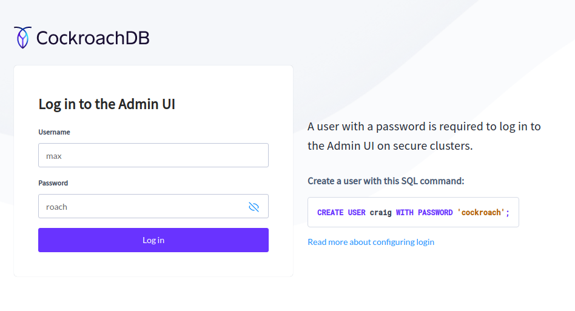  

https://localhost:8080/#/databases/tables:
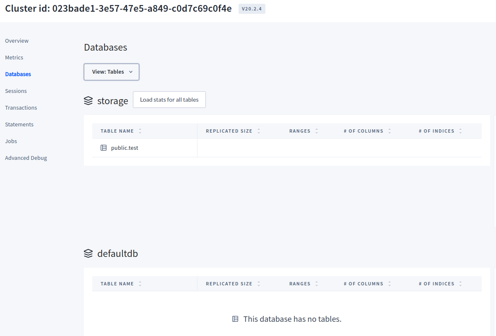  
https://localhost:8080/#/overview/list:
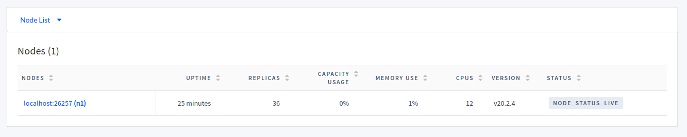  


[Масштабирование до нескольких узлов:](https://www.cockroachlabs.com/docs/v20.2/cockroach-start-single-node#scale-to-multiple-nodes)


Остановите одноузловой кластер:
```
cockroach quit \
--certs-dir=certs \
--host=localhost:26257
```

Перезагрузите узел с помощью [cockroach start] команды:
```
cockroach start \
--certs-dir=certs \
--listen-addr=localhost:26257 \
--http-addr=localhost:8080 \
--join=localhost:26257,localhost:26258,localhost:26259 \
--background
```

Добавьте еще два узла:  
```
cockroach start \
--certs-dir=certs \
--store=node2 \
--listen-addr=localhost:26258 \
--http-addr=localhost:8081 \
--join=localhost:26257,localhost:26258,localhost:26259 \
--background

cockroach start \
--certs-dir=certs \
--store=node3 \
--listen-addr=localhost:26259 \
--http-addr=localhost:8082 \
--join=localhost:26257,localhost:26258,localhost:26259 \
--background
```

Откройте встроенную оболочку SQL:
```
cockroach sql --certs-dir=certs --host=localhost:26257
```

Обновите предварительно настроенные зоны репликации для 3-кратной репликации пользовательских данных
и 5-кратного импорта внутренних данных:

```
ALTER RANGE default CONFIGURE ZONE USING num_replicas = 3;
ALTER RANGE system CONFIGURE ZONE USING num_replicas = 5;
ALTER database system CONFIGURE ZONE USING num_replicas = 5;
ALTER RANGE liveness CONFIGURE ZONE USING num_replicas = 5;
ALTER RANGE meta CONFIGURE ZONE USING num_replicas = 5;
ALTER TABLE system.public.jobs CONFIGURE ZONE USING num_replicas = 5;
ALTER TABLE system.public.replication_constraint_stats CONFIGURE ZONE USING num_replicas = 5;
ALTER TABLE system.public.replication_stats CONFIGURE ZONE USING num_replicas = 5;
```
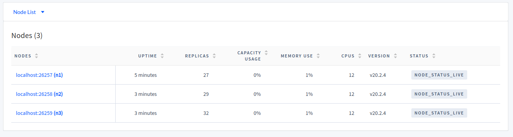  


Имитация отказа узла 3-го узла:

```
cockroach quit --certs-dir=certs --host=localhost:26259
```
Узел стал SUSPECT (подозрительным)

Перезагрузите 3-й узел:

```
cockroach start \
--certs-dir=certs \
--store=node3 \
--listen-addr=localhost:26259 \
--http-addr=localhost:8082 \
--join=localhost:26257,localhost:26258,localhost:26259 \
--background
```


Масштабируйте кластер:
(эти команды такие же , как и раньше , но с уникальными --store, --listen-addr и --http-addr флагами)

Запустите еще 2 узла:
```
cockroach start \
--certs-dir=certs \
--store=node4 \
--listen-addr=localhost:26260 \
--http-addr=localhost:8083 \
--join=localhost:26257,localhost:26258,localhost:26259 \
--background

cockroach start \
--certs-dir=certs \
--store=node5 \
--listen-addr=localhost:26261 \
--http-addr=localhost:8084 \
--join=localhost:26257,localhost:26258,localhost:26259 \
--background
```

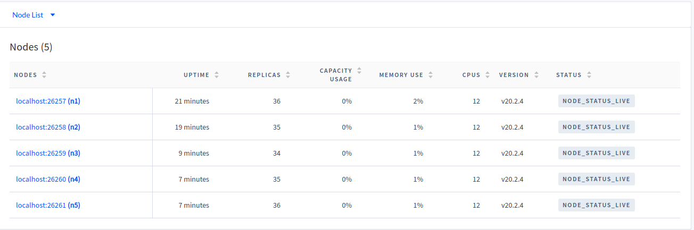  


Остановите кластер:
 (используйте cockroach quit команду для корректного завершения работы каждого узла)
```
cockroach quit --certs-dir=certs --host=localhost:26257
cockroach quit --certs-dir=certs --host=localhost:26258
cockroach quit --certs-dir=certs --host=localhost:26259
cockroach quit --certs-dir=certs --host=localhost:26260
cockroach quit --certs-dir=certs --host=localhost:26261
```


```bash

cockroach start \
--certs-dir=certs \
--store=node1 \
--listen-addr=localhost:26257 \
--http-addr=localhost:8081 \
--join=localhost:26257,localhost:26258,localhost:26259 \
--background

cockroach start \
--certs-dir=certs \
--store=node2 \
--listen-addr=localhost:26258 \
--http-addr=localhost:8081 \
--join=localhost:26257,localhost:26258,localhost:26259 \
--background

cockroach start \
--certs-dir=certs \
--store=node3 \
--listen-addr=localhost:26259 \
--http-addr=localhost:8082 \
--join=localhost:26257,localhost:26258,localhost:26259 \
--background

cockroach start \
--certs-dir=certs \
--store=node4 \
--listen-addr=localhost:26260 \
--http-addr=localhost:8083 \
--join=localhost:26257,localhost:26258,localhost:26259 \
--background

cockroach start \
--certs-dir=certs \
--store=node5 \
--listen-addr=localhost:26261 \
--http-addr=localhost:8084 \
--join=localhost:26257,localhost:26258,localhost:26259 \
--background
```


#### Запуск cockroach через docker-compose в небезопасном режиме http

[dockerHub cockroachdb/cockroach](https://hub.docker.com/r/cockroachdb/cockroach/tags?page=1&ordering=last_updated)

Файл docker-compose.yml:
```yaml

version: '3'

services:
  roach-ui:
    image: cockroachdb/cockroach:${COCKROACH_VERSION:-v2.0.0}
    command: start --insecure
    expose:
    - "8080"
    - "26257"
    ports:
    - "26257:26257"
    - "8080:8080"
    networks:
    - roachnet
    volumes:
    - ./data/roach-ui:/cockroach/cockroach-data
  roach-one:
    image: cockroachdb/cockroach:${COCKROACH_VERSION:-v2.0.0}
    command: start --insecure --join=roach-ui
    networks:
    - roachnet
    volumes:
    - ./data/roach-one:/cockroach/cockroach-data
  roach-two:
    image: cockroachdb/cockroach:${COCKROACH_VERSION:-v2.0.0}
    command: start --insecure --join=roach-ui
    networks:
    - roachnet
    volumes:
    - ./data/roach-two:/cockroach/cockroach-data
  roach-three:
    image: cockroachdb/cockroach:${COCKROACH_VERSION:-v2.0.0}
    command: start --insecure --join=roach-ui
    networks:
    - roachnet
    volumes:
    - ./data/roach-three:/cockroach/cockroach-data
  roach-four:
    image: cockroachdb/cockroach:${COCKROACH_VERSION:-v2.0.0}
    command: start --insecure --join=roach-ui
    networks:
    - roachnet
    volumes:
    - ./data/roach-four:/cockroach/cockroach-data

networks:
  roachnet:
```  

Запуск узлов:
```
$ cd run-http/
$ docker-compose up
```


Создать пользователя max:
```
docker-compose exec roach-ui ./cockroach user set max --insecure
```

Создайте базу данных и предоставьте привилегии:
```
docker-compose exec roach-ui ./cockroach sql --insecure -e 'CREATE DATABASE storage'
docker-compose exec roach-ui ./cockroach sql --insecure -e 'GRANT ALL ON DATABASE storage TO max'
```

Запуск клиента:
```
docker-compose exec roach-ui ./cockroach sql --insecure  --database=books --user=jeka --port=26257
docker-compose exec roach-ui ./cockroach sql --insecure  --url=postgresql://jeka@localhost:26257/storage
```


Создайте таблицу в новой базе данных:
```
docker-compose exec roach-ui ./cockroach sql --insecure \
--database=storage \
--user=jeka \
-e 'CREATE TABLE authors (id INT PRIMARY KEY, balance INT)'

```

Или запуск клиента:
```
docker-compose exec roach-ui ./cockroach sql --insecure
root@:26257> CREATE DATABASE storage;
root@:26257> CREATE TABLE storage.authors (id INT PRIMARY KEY, balance INT);
root@:26257> INSERT INTO storage.authors VALUES (1, 1000);
root@:26257> SELECT * FROM storage.authors;
root@:26257> show databases; // show users;
root@:26257> use storage; // root@:26257/> SET database = storage
root@:26257/books> show tables;


docker-compose exec roach-ui ./cockroach sql --insecure --database=storage

CREATE TABLE IF NOT EXISTS storage.users (id  INT PRIMARY KEY DEFAULT unique_rowid(), email VARCHAR(100)  NOT NULL  UNIQUE, nickname VARCHAR(100) NOT NULL UNIQUE, first_name VARCHAR(100) DEFAULT '', last_name VARCHAR(100) DEFAULT '', birth_date VARCHAR(100) );

```

Монитор:
```
http://127.0.0.1:8080/#/databases/tables

```

Ввойти в клиент:

```
cockroach sql --insecure --host=localhost:26257 --database=storage
```

#### Настройте балансировку нагрузки
```
sudo apt-get i haproxy
```

Запустите cockroach gen haproxy команду, указав порт любого узла:
```
cockroach gen haproxy \
--certs-dir=certs \
--host=localhost \
--port=26257

```

Эта команда создает `haproxy.cfg` файл, автоматически настроенный для работы с узлами вашего работающего кластера.

В `haproxy.cfg` измените bind :26257 на bind :26000.
Это изменяет порт, на котором `HAProxy` принимает запросы на порт, который еще не используется узлом.


Запустите `HAProxy` с `-f` флагом, указывающим на `haproxy.cfg` файл:
```
haproxy -f haproxy.cfg &

output:[2] 17696
```

Завершить HAProxy:
```
sudo pkill haproxy
```

#### Настройка для Node.js

```
npm i pg
npm i async
```
Уже должен быть инициализирован кластер и запущен.
```
# создание базы данных и пользователя
cockroach --certs-dir=certs sql -e "CREATE USER IF NOT EXISTS max;CREATE DATABASE storage;SET database = storage;GRANT ALL ON DATABASE storage TO max;GRANT admin TO max;"

# Создайте сертификат для пользователя max.
cockroach cert create-client max --certs-dir=certs --ca-key=my-safe-directory/ca.key
```

### ORM [TypeORM] с синтаксисом TypeScript и поддержкой CockroachDB

[TypeORM типы для cockroachdb](https://typeorm.io/#/entities/column-types-for-cockroachdb)


```
npm i typescript --save-dev
npm i typeorm --save
npm i reflect-metadata --save
npm i @types/node --save-dev
npm i @types/express -s
npm i pg --save

```

Создадим tsconfig.json файл, содержащий конфигурацию:
```json
{
  "compilerOptions": {
    "lib": ["es5", "es6", "dom","es7","es2015"],
    "target": "es2020",
    "module": "es6",
    "moduleResolution": "node",
    "emitDecoratorMetadata": true,
    "experimentalDecorators": true,
    "strict": true
  },
  "include": [
    "."
  ],
  "exclude":[
    "node_modules"
  ]
}
```

Компиляция:
```
tsc
```


[TypeORM Data Mapper](https://typeorm.io/#/active-record-data-mapper/what-is-the-data-mapper-pattern)

## API

Для обработки межсайтовых HTTP-запросов у запрашеваемой стороны должны совпадать протокол, домен и порт.
CORS позволяет вам в отдельных случаях убирать эти ограничения вплоть до указания списка конкретных доменов,
которым разрешен доступ к сценарию.
Для работы API с внешними источниками использую пакет  `cors`

```
npm install --save cors
```

### [Самоподписанный сертификат https](http://www.selfsignedcertificate.com/)

Ради разработки, просто порт изменится с 80 на 443, для настоящей защиты необходимо купить сертификат.
```
import https from "https";

const optionsHttps = {
    key: fs.readFileSync(__dirname + "/ssl/2885853_127.0.0.13000.key"),
    cert: fs.readFileSync(__dirname + "/ssl/2885853_127.0.0.13000.cert"),
};

https.createServer(optionsHttps, app)
    .listen(app.get("port"), function(){
    console.log("Express started in " + app.get("env") +
        " mode on port " + app.get("port") + " using HTTPS.");
        if(process.env.NODE_ENV == "development"){
            console.info("\x1b[33m%s\x1b[0m","Environment development");
        }
});
```
Если вы используете прокси-сервер, то клиент (браузер пользователя) будет общаться с прокси-сервером,
а не с вашим сервером.
Прокси-сервер, в свою очередь, скорее всего, будет связываться с вашим приложением посредством обычного
HTTP, поскольку ваше приложение и прокси-сервер будут запущены вместе в защищенной сети.
Большей частью, когда вы или ваш хостинг-провайдер корректно сконфигурировали прокси-сервер для обработки 
запросов HTTPS, вам не понадобится делать какуюто дополнительную работу. Исключением из этого правила будет то, 
нужно ли вашему приложению обрабатывать как безопасные, так и небезопасные запросы.
Есть три решения этой проблемы. 
Первая — это просто сконфигурировать ваш прокси-сервер для перенаправления всего HTTP-трафика на HTTPS, по существу
вынуждая все коммуникации с вашим приложением вести через HTTPS. 
Этот подход становится все более распространенным, и это, конечно, довольно простое решение проблемы.

Второй подход — как-то передавать протокол, используемый на стороне связи «клиент — прокси», на сервер. 
Обычный способ — передача этого через заголовок XForwarded-Proto . 
Например, для установки этого заголовка в `Nginx`:
`proxy_set_header X-Forwarded-Proto`

Затем в своем приложении вы можете протестировать, был ли протокол HTTPS:
```
app.get('/', function(req, res){
// следующее по существу эквивалентно: if(req.secure)
if(req.headers['x-forwarded-proto']==='https') {
    res.send('line is secure');
} else {
    res.send('you are insecure!');
}
});
```

В `Nginix` есть отдельный блок конфигурации для HTTP и HTTPS. Если вы не установите
X-Forwarded-Protocol в блоке конфигурации, соответствующем HTTP, вы открываетесь для
возможности подмены заголовка клиентом

Не забудьте указать Express доверять прокси посредством app.enable('trust proxy') .
Когда вы это сделаете, `req.protocol , req.secure и req.ip` будут относиться к соединению клиента
к прокси, а не к вашему приложению.

## Межсайтовая подделка запроса

Атаки межсайтовой подделки запроса (`Cross-Site Request Forgery`, `CSRF`) пользуются тем, что пользователи обычно
доверяют своему браузеру и посещают множество сайтов в течение одной и той же сессии.

В ходе атаки скрипт CSRF на сайте злоумышленника делает запросы другому сайту: если вы залогинены на другом
сайте, сайт злоумышленника может успешно получить доступ к безопасным данным с другого сайта

Способ убедиться в том, что запрос законно пришел от вашего сайта, это передача уникального токена браузера.

Когда браузер отправляет форму, сервер проверяет токены, чтобы убедиться, что они совпадают.
Промежуточное ПО `csurf` само обрабатывает создание и проверку токена

```
npm install --save csurf
```
Использует сеансы, так что должен быть скомпонован после промежуточного ПО express-session
затем скомпонуйте его и добавьте токен к res.locals
// это должно быть вставлено после анализатора тела запроса,
// анализатора cookie и express-сессии

```
    // POST parser
    app.use(bodyParser.json());
    app.use(bodyParser.urlencoded({extended: true}));

    // Cookie
    app.use(cookieParser(credentials.cookieSecret));

    // Session
    app.use(expressSession({
        resave: false,
        saveUninitialized: false,
        secret: credentials.cookieSecret,
    }));

    // register api routes
    app.use("/api/" + config.api.version, routesApi);

    // CSRF
    app.use(csurf());
    app.use(function(req, res, next){
        res.locals._csrfToken = req.csrfToken();
        next();
    });
```

Сейчас на всех ваших формах (и в вызовах AJAX) нужно предоставить поле
с именем _csrf , которое должно совпадать со сгенерированным токеном.
```
<form action="/newsletter" method="POST">
    <input type="hidden" name="_csrf" value="{{_csrfToken}}">
    Name: <input type="text" name="name"><br>
    Email: <input type="email" name="email"><br>
    <button type="submit">Отправить</button>
</form>
```


## Вход через Facebook

https://developers.facebook.com/apps/
[Примеры](https://developers.facebook.com/docs/javascript/examples)
[Настройка](https://support.webasyst.ru/20596/auth-facebook/)

Создать приложение

* Создание кросс-серверных функций
  Подключите потребительские продукты, такие как вход через Facebook..

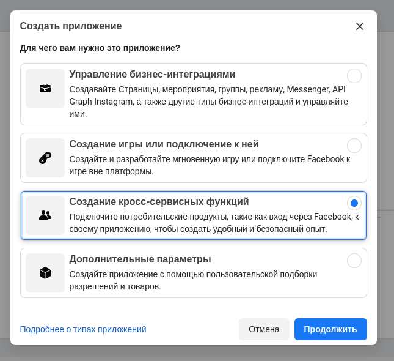

* Отображаемое название приложения.\
  Это название приложения, связанное с его ID.
  `pet-node`


Вход через Facebook

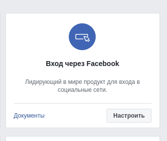  

1. Ваш сайт  
Для WEB\
Укажите URL своего сайта. URL сайта
`https://b401171eb093.ngrok.io`

2. Настройка Facebook SDK для Javascript

 Вставьте следующий сниппет кода прямо после открывающего тега <body> на каждой странице, на которой вы хотите
 использовать Facebook Analytics.\
 Замените `your-app-id` ID приложения, а `api-version` — версией API, которая вам нужна.\
 Актуальная на данный момент версия - v9.0

 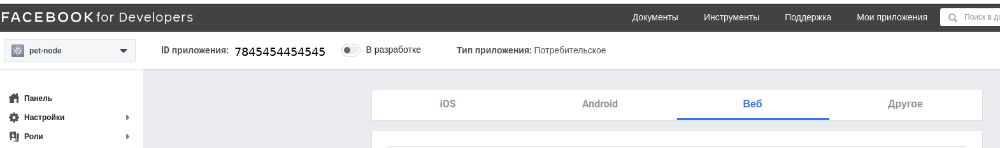

```
<script>
    // Авто-проверка пользователя
    window.fbAsyncInit = function() {
        FB.init({
            appId      : 'ID приложения',
            xfbml      : true,
            version    : 'v9.0'
        });
        FB.AppEvents.logPageView();
        FB.getLoginStatus(function(response) {
            statusChangeCallback(response);
        });
    };

    function statusChangeCallback(response){

        console.log("response=",response); // Текущий статус входа человека.
        if (response.status === 'connected') {
            // Авторизовался на своей веб-странице и в Facebook.
            // предоставьте ему возможность работать с приложением как зарегистрированному пользователю.
            $('#login_block').hide();
            document.getElementById('status').innerHTML = "";

            var uid = response.authResponse.userID;
            var expiresIn = response.authResponse.expiresIn;
            var accessToken = response.authResponse.accessToken;
            console.log("uid:%s,accessToken:%s",uid,accessToken);

            console.log('Successful login for: %s, userID=%s. Срок действия маркера истечет в %s' ,
                    response.name,
                    uid,
                    new Date( new Date().getTime()+ expiresIn ).toLocaleString() );

            $('#fb_custom_login').hide();

           testAPI();
        } else {
            // Вы не авторизовались на вашей веб-странице
            // предложите ему диалог «Вход» с элементом FB.login() или покажите кнопку «Вход»

            $('#login_block').show();
            document.getElementById('status').innerHTML = "Вы не авторизованны.";

            $('#fb_custom_logout').hide();
        }
    }

    // Тестирование Graph API после входа в систему.
    // См. StatusChangeCallback (), чтобы узнать, когда выполняется этот вызов.
    function testAPI() {
        console.log('Welcome!  Fetching your information.... ');
        FB.api('/me?fields=name,email,picture,first_name,last_name', function(response) {

            console.log('Successful login for: %s' , response.name);
            // Регистрация пользователя
            document.getElementById('status').innerHTML = "Спасибо за вход, " + response.name + '!';
        });
    }

    // Загрузка Facebook SDK.js
    (function(d, s, id){
        var js, fjs = d.getElementsByTagName(s)[0];
        if (d.getElementById(id)) {return;}
        js = d.createElement(s); js.id = id;
        js.src = "https://connect.facebook.net/en_US/sdk.js";
        fjs.parentNode.insertBefore(js, fjs);
        js.onload= function(){

        };
    }(document, 'script', 'facebook-jssdk'));
</script>

<!-- Или так загрузить Facebook SDK.js
<script async defer crossorigin="anonymous" src="https://connect.facebook.net/en_US/sdk.js"></script> -->

<!-- А. Вход с помощью кнопки "Вход"
При авторизации кнока изменится на Выход
-->

<!-- Показать кнопку FACEBOOK LOGIN -->
<div class="fb-login-button" data-width="" data-size="large" data-button-type="continue_with" data-layout="default" data-auto-logout-link="true" data-use-continue-as="false"></div>
<!-- или так показать кнопку
<fb:login-button scope="public_profile,email" onlogin="checkLoginState();"></fb:login-button> -->


<!-- Б. Вход с помощью диалога входа из SDK для JavaScript
Чтобы использовать собственную кнопку, вызывайте диалог входа-->

<div class="buttons">
    <button id="fb_custom_login" class="button is-primary">FACEBOOK LOGIN</button>
    <button id="fb_custom_logout" class="button is-primary">FACEBOOK LOGOUT</button>
</div>

<script>
    $(document).ready(function() {
        $("#fb_custom_login").on("click",function(){
            FB.login(function(response) {
                if (response.status === 'connected') {
                    // Logged into your webpage and Facebook.
                    $('#fb_custom_login').hide();
                    $('#fb_custom_logout').show();

                   var uid = response.authResponse.userID;
                   var accessToken = response.authResponse.accessToken;
                   console.log("uid:%s,accessToken:%s",uid,accessToken);

                    FB.api('/me?fields=name,email,picture,first_name,last_name', function(response) {
                        // Регистрация пользователя
                        console.log("RESPONSE:",response);
                        document.getElementById('status').innerHTML = "Спасибо за вход, " + response.name + " EMAIL:"+ response.email + "!";
                    });

                } else {
                    // The person is not logged into your webpage or we are unable to tell.
                    $('#fb_custom_login').show();
                    $('#fb_custom_logout').hide();
                }
            }, {scope: 'public_profile,email',size:'large',auto_logout_link:true,onlogin:function(){ console.log('Запускается после завершения процесса входа');}});
        });
        $("#fb_custom_logout").on("click",function(){
            FB.logout(function(response) {
                // Person is now logged out
                $('#fb_custom_login').show();
                $('#fb_custom_logout').hide();
                document.getElementById('status').innerHTML = "Вы не авторизованны.";
            });
        });
    });

</script>


<div id="status" class="subtitle" ></div>

```
3. Проверка статуса входа\
Первое, что нужно сделать при загрузке веб-страницы, — проверить, не вошел ли уже человек в ваше приложение
с помощью «Входа через Facebook».
Вызовите FB.getLoginStatus.
На Facebook будет отправлен вызов для получения статуса входа, и будет активирована функция обратного вызова
для предоставления результатов.


`status` сообщает о состоянии входа человека в приложение.
         Состояние может принимать одно из следующих значений:

* `connected` — человек выполнил вход на Facebook и в ваше приложение.

* `not_authorized` — человек выполнил вход на Facebook, но не вошел в приложение.

* `unknown` — человек не вошел на Facebook, поэтому неизвестно, выполнен ли вход в приложение, либо FB.logout() был
            вызван раньше и поэтому не может подключиться к Facebook.

Если статус имеет значение `connected`, в ответ входят следующие параметры `authResponse`:

`authResponse` будет добавлен, если статус — `connected` и состоит из следующих элементов:

* `accessToken` — содержит маркер доступа для пользователя приложения.

* `expiresIn` — указывает UNIX-время, когда срок действия маркера истечет и его нужно будет обновить.

* `signedRequest` — параметр подписи, содержащий сведения о пользователе приложения.

* `userID` — указывает ID пользователя приложения.

Когда состояние входа определено, можно выбрать один из следующих вариантов:
* Если человек вошел на Facebook и в приложение, предоставьте ему возможность работать с приложением как
  зарегистрированному пользователю.
* Если человек не вошел в приложение или на Facebook, предложите ему диалог «Вход» с элементом FB.login() или
  покажите кнопку «Вход».

[Разместить кнопку «Вход»](https://developers.facebook.com/docs/facebook-login/web/login-button)

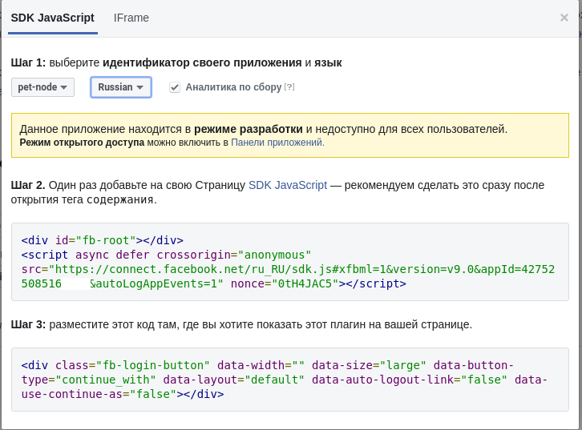


#### Тестирование входа через Facebook
Для тестирования нужен действительный сертификат https, а не тестовый.

[Установка ngrok:](https://snapcraft.io/install/ngrok/ubuntu)

```
sudo apt update
sudo apt install snapd
sudo snap install ngrok
```

Запуск Авторизированного тунеля (дольше времени работает):

```
ngrok http 3000 --authtoken ..хеш--FRpynN_7E3F3MfUftid...

Выдал такой URL:
https://b401171eb093.ngrok.io
```
Запуск не авторизированного тунеля (на 40 минут):
```
ngrok http 3000
```
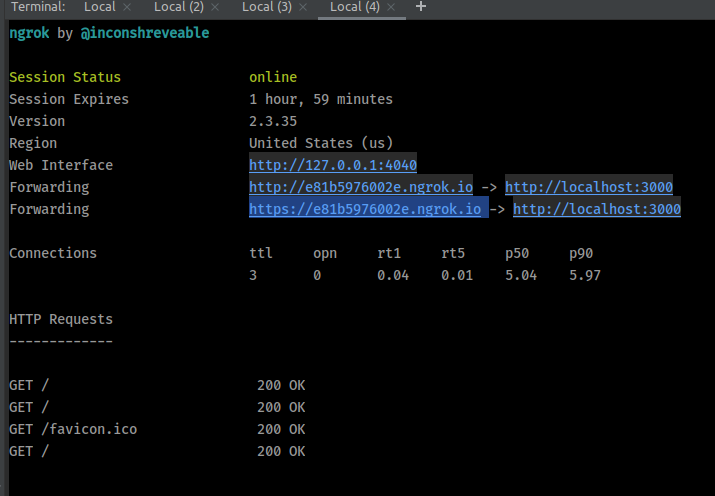

[Прочтите документацию:](https://ngrok.com/docs)
```
./ngrok help
```

#### Установка [Password](https://www.npmjs.com/package/passport)
```
npm install --save passport passport-facebook
```

```
import {funcAuth} from "~lib/auth.js";
import {credentials} from "~ui/routes/_mod.js";

app.use(passport.initialize());
app.use(passport.session());

// Для авторизации перейти на  `https://b401171eb093.ngrok.io/auth/facebook`
// Для ожидания ответа `https://b401171eb093.ngrok.io/auth/facebook/callback` (необходимо зарегистрировать в приложении
           как 'Действительные URI перенаправления для OAuth')

// authentication
var auth = funcAuth(app, {
    baseUrl: process.env.BASE_URL,
    providers: credentials.authProviders,
    successRedirect: '/account',
    failureRedirect: '/unauthorized',
});
// auth.init() links in Passport middleware:
auth.init();

// now we can specify our auth routes:
auth.registerRoutes();


app.get("/account", function(req, res) {
    if(!req.user)
        return res.redirect(303, "/unauthorized");
    res.render("users/account", { layout: "bulma", username: req.user.name });
});
// нам также нужна страница "Не авторизирован"
app.get("/unauthorized", function(req, res) {
    res.status(403).render("users/unauthorized",{layout: "bulma"});
});
app.get("/", function(req, res) {
    res.render("home", { layout: "bulma" });
});
```

```
import passport from "passport";
import {Strategy as FacebookStrategy} from "passport-facebook";

// настройка ------------------------------------------------------------------------------
let User = {
    id: 1234,
    authId: "facebook:7438246551***",
    name: "jerry",
    email: "email@email.com",
    created:Date.now(),
    role: "customer",
};
function getUser(authId){
    console.log("SEARCH USER_ID:%s",authId); // SEARCH USER_ID:facebook:7438246551***
    return User;
}
// для установки соответствия запросов аутентификации пользователя
passport.serializeUser(function(user, done){
    // сохранить в сессии id
    console.log("serializeUser:",user);
    const id = user.getAuthId();
    if(id){
        done(null, user.getAuthId());// User domain
    }else{
        done("Error message", null);
    }

});
passport.deserializeUser(function(id, done){
    console.log("6) deserializeUser id=",id);
    userHundler.getUserSocial(id).then(user =>{
        console.log("deserializeUser user=",user);

        if(!user) return done("Error message", null);
        const user_view = new UserView(user);// Модель которая будет храниться в сессии
        done(null, user_view);
    });
});

// Пока сессия активна и пользователь успешно прошел аутентификацию,
// req.session.passport.user будет соответствовать экземпляру модели User

//----------------------------------------------------------------------------------------

// Для включения функциональности Passport нужно сделать два отдельных мероприятия:
// - инициализировать Passport;
// - зарегистрировать маршруты, которые будут обрабатывать аутентификацию и перенаправленные обратные вызовы
//      от наших сервисов сторонней аутентификации;


// baseUrl https://b401171eb093.ngrok.io


export function funcAuth (app, options){
// если перенаправления для успеха и неуспеха не определены,
// установите разумные значения по умолчанию
    if(!options.successRedirect)
        options.successRedirect = "/account";
    if(!options.failureRedirect)
        options.failureRedirect = "/unauthorized";
    return {
        init: function() {

            var env = app.get("env");
            var config = options.providers;
            // конфигурирование стратегии Facebook
            // callbackURL зарегистрировать в доменах приложения фейсбука
            passport.use(
                new FacebookStrategy(
                    {
                        clientID: config.facebook[env].appId,// это ID приложения фейсбука
                        clientSecret: config.facebook[env].appSecret,// это Секрет приложения фейсбука
                        callbackURL: (options.baseUrl || "") + "/auth/facebook/callback"// это адрес возврата с фейсбука
                    },
                    function(accessToken, refreshToken, profile, done){
                        // Если запись пользователя не вернулась, мы создаем новую модель User и сохраняем ее в базе данных.
                        let authId = "facebook:" + profile.id;
                        let user = getUser(authId);
                        return done(null, user);
                        // иначе  создать пользователя и вернуть
                    }
                )
            );

            app.use(passport.initialize());
            app.use(passport.session());
        },

        registerRoutes: function() {
            // регистрируем маршруты Facebook
            app.get("/auth/facebook", function(req, res, next){
                // посещение этого пути автоматически
                // перенаправит посетителя на страницу аутентификации Facebook
                // req.query.redirect - Так мы можем автоматически перенаправлять
                //   пользователя к месту назначения после завершения аутентификации.
                if(req.query.redirect) req.session.authRedirect = req.query.redirect;
                passport.authenticate("facebook")(req, res, next);
            });

            // После того как пользователь авторизован посредством facebook, браузер будет перенаправлен
            // обратно на ваш сайт
            // В строке запроса также есть токены аутентификации, которые проверяются Passport.
            // Если проверка прошла неуспешно, Passport перенаправил браузер на options.failureRedirect .
            // Если проверка прошла успешно, Passport вызовет next() , то есть то место, куда
            // ваше приложение возвращается.
            app.get("/auth/facebook/callback",
                // `/auth/facebook/callback:passport.authenticate()`  вызывается первым.
                // Если он вызывает next() , управление переходит к вашей функции, что
                // затем перенаправляет либо в исходное место, либо на options.successRedirect , если
                // параметр перенаправления строки запроса не был указан
                passport.authenticate("facebook",{ failureRedirect: options.failureRedirect }),

                function(req, res){
                // мы сюда попадаем только при успешной аутентификации
                    var redirect = req.session.authRedirect;
                    if(redirect) delete req.session.authRedirect;
                    res.redirect(303, redirect || options.successRedirect);
                }
                // Как только аутентификация пользователя пройдет успешно, будет установлен req.session.passport.user ,
                // и таким образом будущие запросы будут знать, что этот пользователь прошел аутентификацию.
            );
        },
    };
};
```

Проблема:

 * FacebookAuthorizationError: Невозможно загрузить URL: Домен этого URL не включен в список доменов приложения.
Чтобы загрузить этот URL, добавьте все домены и поддомены своего приложения в поле «Домены приложения»
в настройках вашего приложения.


Решение:

 1.Добавить все домены
  Настройки/ Дополнительно/
  Диспетчер доменов Добавить домен
  https://b401171eb093.ngrok/
  https://b401171eb093.ngrok.io/auth/facebook/callback
  https://b401171eb093.ngrok.io/


2. Товары/ Вход через Facebook / Клиентские настройки OAuth/
   Действительные URI перенаправления для OAuth
   https://b401171eb093.ngrok.io/auth/facebook/callback

### Google Auth

Создать новое приложение в [google dev:](https://console.developers.google.com/cloud-resource-manager)
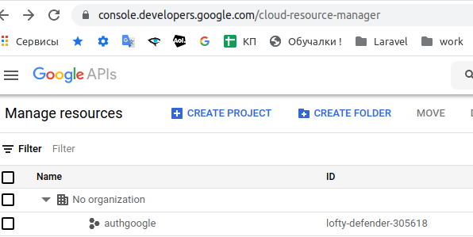
 
Открыть вкладку APIs Services/OAuth consent screen:
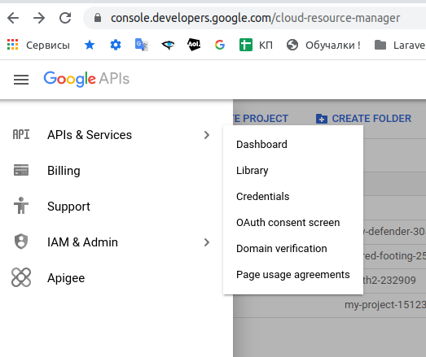
 
 И заполнить форму, в которой требуется указать: 
 название приложения, email для связи, домен вашего сайта, ссылки на главную сайта и политику конфиденциальности.
 
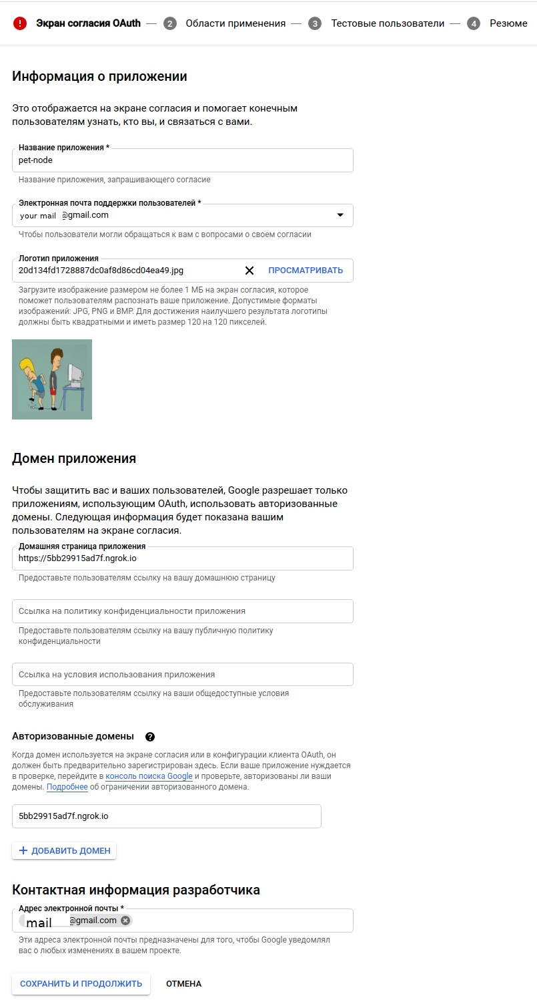
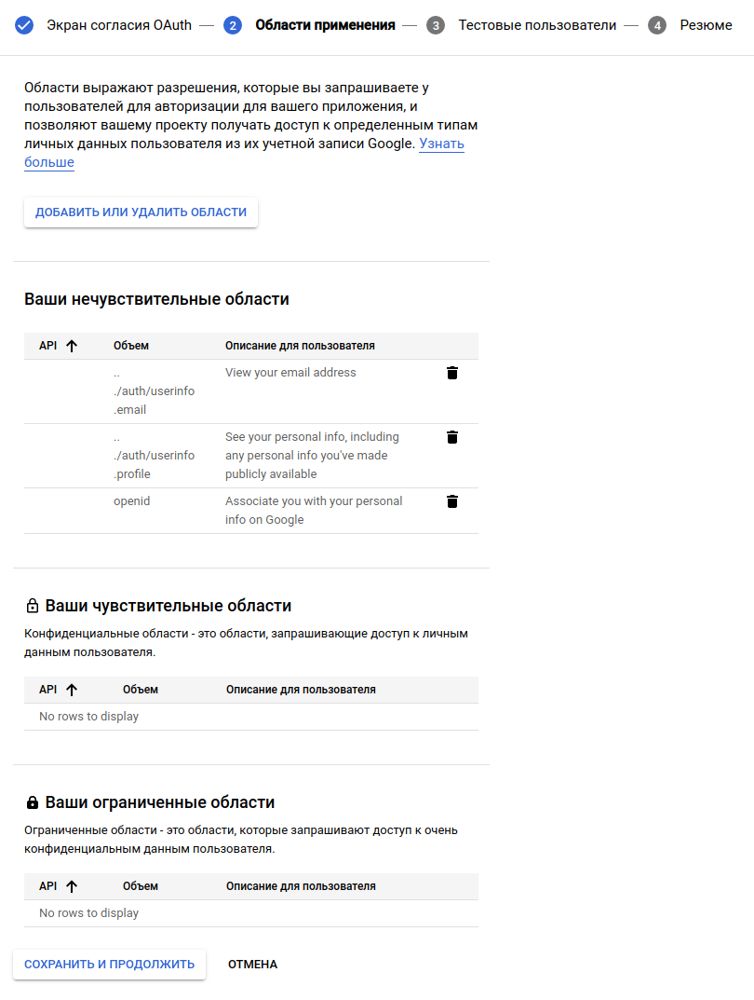
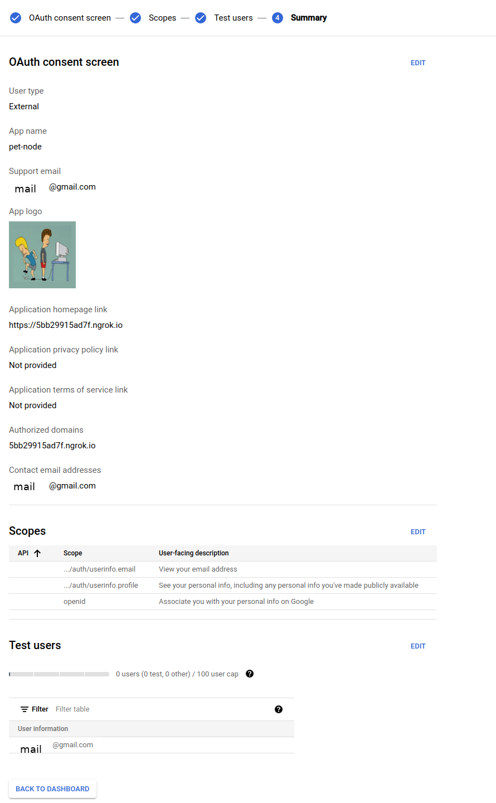
   
Далее перейти на Credentials/ + СОЗДАТЬ УЧЕТНЫЕ ДАННЫЕ/Идентификатора клиента OAuth:
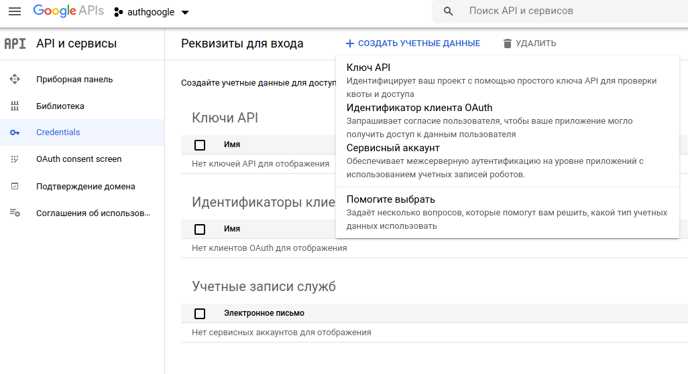

Выбрать тип приложения и URL перенаправления:
 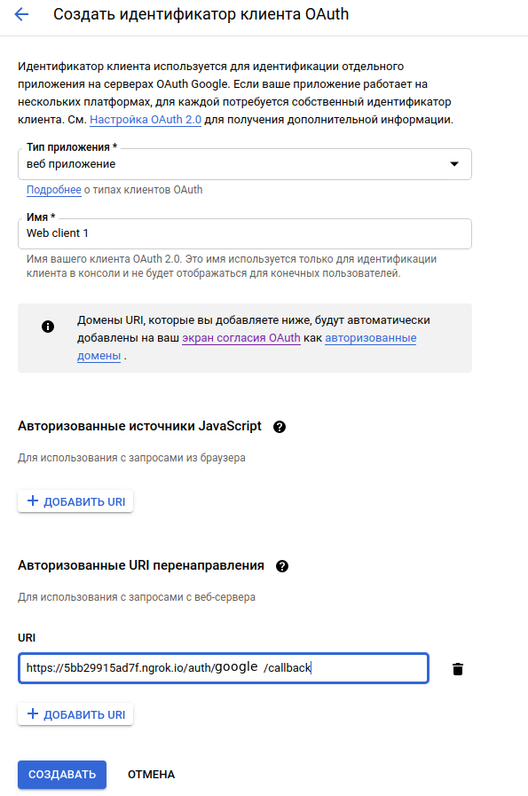 
 
 После этого получим индификатор клиента и ключ.
 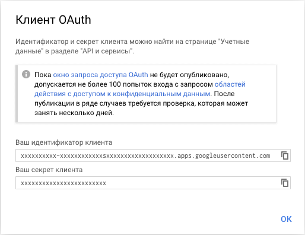 
 
 Ссылка для входа
 Сформируем ссылку для авторизации пользователя:
 ```
$params = array(
	'client_id'     => 'ИНДИФИКАТОР_КЛИЕНТА',
	'redirect_uri'  => 'https://example.com/login_google.php',
	'response_type' => 'code',
	'scope'         => 'https://www.googleapis.com/auth/userinfo.email https://www.googleapis.com/auth/userinfo.profile',
	'state'         => '123'
);
 
$url = 'https://accounts.google.com/o/oauth2/auth?' . urldecode(http_build_query($params));
echo '<a href="' . $url . '">Авторизация через Google</a>';
```

 Перейдя по такой ссылки увидим следующий запрос:
  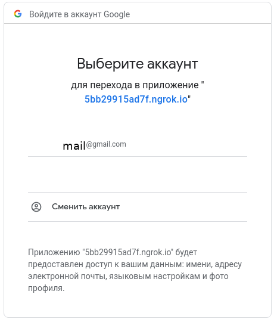
 
Код скрипта
После подтверждения запроса, будет выполнен редирект на указанный PHP-скрипт, в GET-параметр добавится код авторизации,
 меняем его на токен и получаем данные пользователя.
 
```
<?php
if (!empty($_GET['code'])) {
	// Отправляем код для получения токена (POST-запрос).
	$params = array(
		'client_id'     => 'ИНДИФИКАТОР_КЛИЕНТА',
		'client_secret' => 'СЕКРЕТ_КЛИЕНТА',
		'redirect_uri'  => 'https://example.com/login_google.php',
		'grant_type'    => 'authorization_code',
		'code'          => $_GET['code']
	);	
			
	$ch = curl_init('https://accounts.google.com/o/oauth2/token');
	curl_setopt($ch, CURLOPT_POST, 1);
	curl_setopt($ch, CURLOPT_POSTFIELDS, $params); 
	curl_setopt($ch, CURLOPT_RETURNTRANSFER, true);
	curl_setopt($ch, CURLOPT_SSL_VERIFYPEER, false);
	curl_setopt($ch, CURLOPT_HEADER, false);
	$data = curl_exec($ch);
	curl_close($ch);	
 
	$data = json_decode($data, true);
	if (!empty($data['access_token'])) {
		// Токен получили, получаем данные пользователя.
		$params = array(
			'access_token' => $data['access_token'],
			'id_token'     => $data['id_token'],
			'token_type'   => 'Bearer',
			'expires_in'   => 3599
		);
 
		$info = file_get_contents('https://www.googleapis.com/oauth2/v1/userinfo?' . urldecode(http_build_query($params)));
		$info = json_decode($info, true);
		print_r($info);
	}
}

output:
array(
	'id' => '123456789123456789',
	'email' => 'mail@example.com',
	'verified_email' => true,
	'name' => 'Иван Иванов',
	'given_name' => 'Иван',
	'family_name' => 'Иванов', 
	'picture' => 'https://.../photo.jpg', 
	'locale' => 'ru'
}
``` 
 
 
```
npm install -save passport-google-oauth
```
 

------------------------------------------------------------------------------------------------------------------------
[TypeORM]:(https://typeorm.io)
[cockroach start]:(https://www.cockroachlabs.com/docs/v20.2/cockroach-start)
